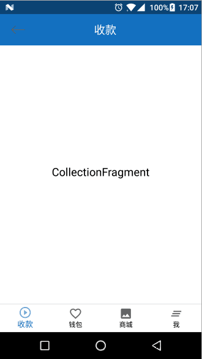

# Solve-StatusBar-VirtualKeyBoard

----

## **[解决华为手机沉浸式状态栏和虚拟键盘冲突问题(具体的请点击这里)](https://github.com/AweiLoveAndroid/Solve-StatusBar-VirtualKeyBoard/blob/master/app/src/main/java/com/lzw/demo/MainActivity.java)**

Activity里面的重点操作，这里介绍只贴重点代码，onCreate方法：

	@Override
	protected void onCreate(Bundle savedInstanceState) {
		super.onCreate(savedInstanceState);
		setContentView(R.layout.activity_main);
		toolbar_title = (TextView) findViewById(R.id.toolbar_title);

		highApiEffects();
		mToolBar = (Toolbar) getWindow().findViewById(R.id.home_title);
		setSupportActionBar(mToolBar);
	}

这里是核心方法（项目中应该写在BaseActivity里面）：

	@TargetApi(Build.VERSION_CODES.KITKAT)
	private void highApiEffects() {
		getWindow().getDecorView().setFitsSystemWindows(true);
		//透明状态栏 @顶部
		getWindow().addFlags(WindowManager.LayoutParams.FLAG_TRANSLUCENT_STATUS);
		//透明导航栏 @底部    这一句不要加，目的是防止沉浸式状态栏和部分底部自带虚拟按键的手机（比如华为）发生冲突，注释掉就好了
		//getWindow().addFlags(WindowManager.LayoutParams.FLAG_TRANSLUCENT_NAVIGATION);
	}

>这里一定要注意：
>
> getWindow().addFlags(WindowManager.LayoutParams.FLAG_TRANSLUCENT_NAVIGATION);
>
> 这句代码千！万！不！要！加！！！加了就会起冲突！到这里，沉浸式状态栏和底部虚拟按键的冲突问题就得到解决了

下面看一下我三个不同手机系统版本的沉浸式状态栏截图：

Android 4.2.2，无沉浸式状态：

Android 5.1： 

Android 7.1.1，底部带虚拟按键，也就是我们本篇文章的主题： 

